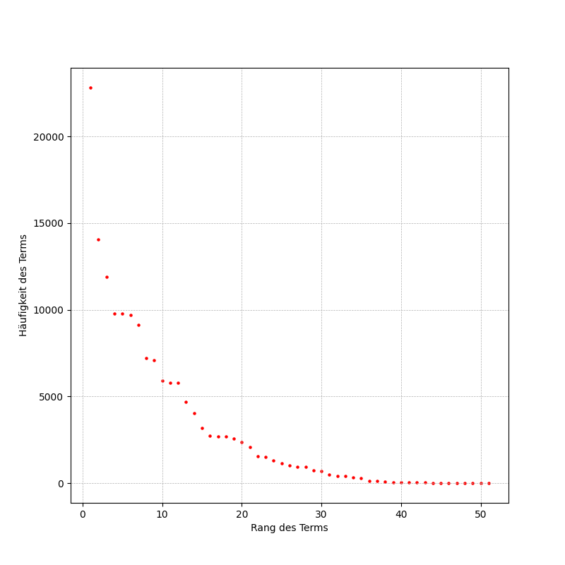

# Praxisteil Nr. 2

## Fortführung des 1. Praxisteils

### Verbesserung der Tokennormalisierung durch Entfernung von Korrekturannotationen am Ende von Tokens

```sh
cd 02
python 01_tokenizer-with-corrections-removal.py
```

Resultat: Es wurden 30874 Tokens in der Datei `tokens.txt gespeichert.

Folgende Suffixe wurden entfernt:

```
Suffix entfernt: Leid[Lied] -> Leid
Suffix entfernt: An[Am] -> An
Suffix entfernt: beknurren[?] -> beknurren
Suffix entfernt: glimmen[klimmen] -> glimmen
Suffix entfernt: —[Hintern] -> —
Suffix entfernt: ehrerbietieg[ehrerbietig] -> ehrerbietieg
Suffix entfernt: Wachspropfen[Wachspfropfen] -> Wachspropfen
Suffix entfernt: bei[bey] -> bei
Suffix entfernt: Doch[Dich] -> Doch
Suffix entfernt: bequemen[,] -> bequemen
Suffix entfernt: bringen[?] -> bringen
Suffix entfernt: lezte[letzte] -> lezte
Suffix entfernt: weg[!] -> weg
Suffix entfernt: Stecken[Strecken] -> Stecken
Suffix entfernt: f—t[farzt] -> f—t
Suffix entfernt: st—t[stinckt] -> st—t
Suffix entfernt: —[groß] -> —
Suffix entfernt: Weise[Weile] -> Weise
```

### Entfernung von zusätzlichen Textteilen in Header und Footer, die nicht zum Originaltext gehören

```sh
python 02_improved-filter-content.py
```

Resultat: Datei `21000_filtered.txt` enthält nach der Ausführung nur noch den Originaltext.

### Ausführung der verbesserten Tokenisierung auf der neuen Textdatei `21000_filtered.txt`

```sh
python python 01_tokenizer-with-corrections-removal.py
```

Resultat: Es wurden 30742 Tokens in der Datei `tokens.txt` gespeichert. Damit reduziert sich die Anzahl der Tokens um 132.

### Erneute Bestimmung der Termlängen

```sh
python 03_term-lengths.py
```

Resultat:

```
Minimale Termlänge: 1
Maximale Termlänge: 23
Durchschnittliche Termlänge: 2.1230238761303752

Terme mit minimaler Länge:
h in UTF-8 Kodierung: 68
o in UTF-8 Kodierung: 6F
— in UTF-8 Kodierung: E2 80 94
– in UTF-8 Kodierung: E2 80 93

Terme mit maximaler Länge:
schneckeschnickeschnack
```

### Das Gesetz von Zipf

```sh
python 04_zipf-law.py
```

Resultat:



## Alternative Tokenizer

### RegEx Tokenizer

Aufspaltung des Orginaltextes auf Basis eines regulären Ausdrucks.

```sh
pip install nltk
python 05_regex-tokenizer.py
```

Resultat: Es wurden 31957 Tokens in der Datei tokens.txt gespeichert.

Die Anzahl der Token bei der Verwendung des RegEx-Tokenizers steigt leicht an (im Vergleich zum Whitespace-Tokenizing).

### NLTL Tokenizer

Wir nutzen den Tokenizer der Python-Programmbibliothek NLTK.

Hier muss beachtet werden, dass der Tokenizer sprachabhängig ist. Da der Originaltext deutschsprachig ist, muss die Sprache `german` beim Aufruf des Tokenizer übergeben werden.

```sh
python 06_nltk-tokenizer.py
```

Resultat: Es wurden 30674 Tokens in der Datei tokens.txt gespeichert.

Die Anzahl der Tokens ist im Vergleich zu den beiden anderen Tokenisierungsansätzen geringer.

## Normalisierung von Tokens

### Ermittlung von Stoppwortkanidaten

```sh
python 07_stopwords.py
```

Resultat:

```
und:917
ich:701
die:665
der:601
nicht:425
zu:398
ein:398
das:397
ist:389
in:327
du:319
sie:303
es:295
so:294
mephistopheles:286
den:276
mit:274
faust:266
mir:265
sich:264
ihr:260
mich:243
er:234
was:230
wie:227
auf:209
dem:193
nur:182
von:174
an:172
doch:169
euch:138
wenn:131
```

### Stemming mittels Snowball-Stemmer

Wir nutzen den in NLTK eingebauten Snowball-Stemmer für die deutsche Sprache.

Auch hier muss die Sprache (`german`) des Originaltexts mitgegeben werden, da das Stemming sprachsensitiv ist:

```python
stemmer = SnowballStemmer("german")
```

```sh
python 08_snowball-stemmer.py
```

Resultat (gekürzt):

```
feiertage → feiertag
alte → alt
singen → sing
himmlischen → himmlisch
gessen → gess
verbrennen → verbrenn
drüben → drub
rauhe → rauh
sophiste → sophist
erreichen → erreich
…
```