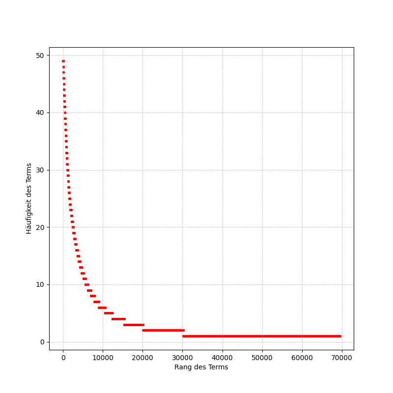
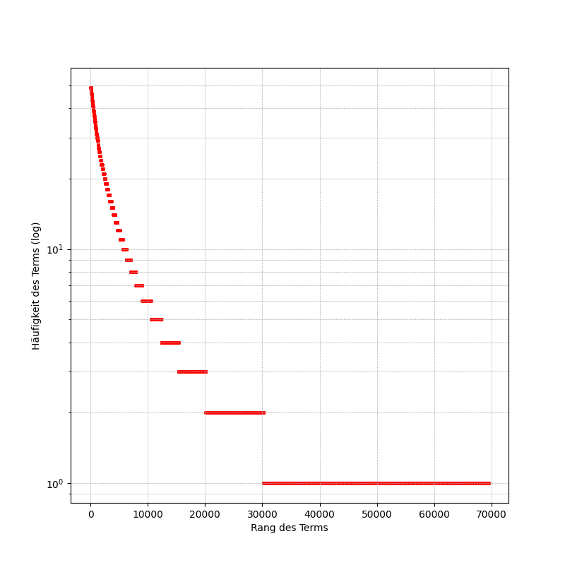

# Praxisteil Nr. 3

## n-Gramme (n aufeinanderfolgende Tokens)

Ermittlung der Top-20-Bigrams und Top-20-Trigrams.

```sh
cd 03
pip install nltk
python 01_n-grams.py
```

Ausgabe:

```
Top 20 Bigramme:
das ist: 49
in der: 40
es ist: 38
ich bin: 31
hab ich: 29
ich nicht: 27
ist ein: 27
bin ich: 26
wenn ich: 26
aus dem: 26
in die: 26
ich mich: 22
mit dem: 22
daß ich: 21
auf der: 21
ist das: 20
die welt: 20
durch die: 19
mir die: 19
und die: 19

Top 20 Trigramme:
es ist ein: 11
mephistopheles zu faust: 8
das ist die: 7
lieb im leibe: 6
wenn ich nur: 5
aus dem haus: 5
in die welt: 5
hier ist ein: 5
das ist der: 5
was willst du: 5
in der nähe: 4
nach und nach: 4
auf der erde: 4
hab ich mich: 4
fühl ich mich: 4
in der hand: 4
das ist ein: 4
juchhe juchhe juchheisa: 4
juchhe juchheisa heisa: 4
juchheisa heisa he: 4
```

# 3. Praxisteil am 5.4.2025

## Erweiterung der Dokumentkollektion: deutschsprachige Originalwerke von Goethe

### Web Scraping zur Ermittlung der Download-URLs

```sh
pip install bs4
python 02_fetch-urls-goethe-german-works.py
```

Resultat: Es wurden 49 Werke von Goethe gefunden.
Die URLs der Werke wurden in die Datei `Goethe-ebooks.txt` gespeichert.

### Harvesting der Volltextdateien der Originalwerke von Goethe

Die URLs der Volltextdateien stehen in der Datei `Goethe-ebooks.txt`. Die Dateien werden nacheinander heruntergeladen und im Verzeichnis `goethe-works` gespeichert.

```sh
python 03_fetch-goethe-german-works.py
```

Ausgabe (gekürzt):

```
Herunterladen von https://www.gutenberg.org/ebooks/10428.txt.utf-8
Datei erfolgreich heruntergeladen: goethe-works/10428.txt
Herunterladen von https://www.gutenberg.org/ebooks/17657.txt.utf-8
Datei erfolgreich heruntergeladen: goethe-works/17657.txt
Herunterladen von https://www.gutenberg.org/ebooks/2402.txt.utf-8
Datei erfolgreich heruntergeladen: goethe-works/2402.txt
Herunterladen von https://www.gutenberg.org/ebooks/31216.txt.utf-8
Datei erfolgreich heruntergeladen: goethe-works/31216.txt
…
49 Dateien erfolgreich heruntergeladen.
```

### Volltexte (Originaltext) extrahieren

Das haben wir bereits sehr intensiv für den Volltext Faust I von Goethe untersucht.

```sh
python 04_filter-content.py
```

Ausgabe:

```
Extrahierter Text wurde gespeichert in: goethe-works/2228-filtered.txt
Extrahierter Text wurde gespeichert in: goethe-works/10425-filtered.txt
Extrahierter Text wurde gespeichert in: goethe-works/49593-filtered.txt
Extrahierter Text wurde gespeichert in: goethe-works/2406-filtered.txt
Extrahierter Text wurde gespeichert in: goethe-works/2407-filtered.txt
…
```

### Erzeugung eines Vorwärtsindex

```sh
python 05_create-forward-index.py
```

Das Script verarbeitet nacheinander die gefilterten Textdateien im Verzeichnis `goethe-works`.

Ausgabe für die Eingabedatei `5326-filtered.txt`:

```
Es wurden 7250 Tokens in der Datei goethe-works/5326-filtered-tokens.txt gespeichert.
Es wurden 2582 Terme in der Datei 5326-filtered-terms.txt gespeichert.
Type Token Ratio (TTR): 0.356
```

In der Datei `5326-filtered-tokens.txt` sind alle Tokens enthalten.

In der Datei `5326-filtered-terms.txt` sind alle Terme enthalten (d.h. jedes Token wird nur genau einmal gespeichert).

### Erzeugung eines invertierten Index für die Volltextsuche

```sh
python 06_create-inverted-index.py
```

Ausgabe:

```
Es wurden 69505 Terme in den invertierten Index eingetragen.
Invertierter Index wurde in Goethe-inverted-index.json gespeichert.
```

Ausschnitt aus der Datei `Goethe-inverted-index.json`:

```
    "gretchen": [
        "2229",
        "2230",
        "2411",
        "21000"
    ],
```

### Einfache Keyword-Suche

```sh
python 07_simple_keyword_search.py
```

Beispielsitzung:

```
Gib ein Suchwort ein (oder 'quit!'): mathe
Es wurden leider keine Treffer gefunden.
Gib ein Suchwort ein (oder 'quit!'): mathematik
1. Treffer in Dokument 2409
2. Treffer in Dokument 2410
Gib ein Suchwort ein (oder 'quit!'): Mathematik
1. Treffer in Dokument 2409
2. Treffer in Dokument 2410
Gib ein Suchwort ein (oder 'quit!'): quit!
```

### Gesetz von Zipf: Betrachtung der Dokumentkollektion

```sh
python 08_zipf-law-revisited.py
```

#### Resultat



### Resultat mit logarithmischer vertikaler Achse



# 4. Praxisteil am 5.4.2025

## Metadatenanreicherung

Titel der Werke von Goethe von Gutendex abrufen und in einer SQLite Datenbank speichern:

```sh
pip install sqlite3
python 09_get-titles.py
```

## Einfache Keyword-Suche mit Ausgabe des Dokumenttitels

```sh
python 10_simple_keyword_search_extended.py
```

Beispielausgabe:

```
Gib ein Suchwort ein (oder 'quit!'): stuttgart
1: Götz von Berlichingen mit der eisernen Hand: Ein Schauspiel
2: Goethe und Werther: Briefe Goethe's, meistens aus seiner Jugendzeit
Gib ein Suchwort ein (oder 'quit!'): hamburg
1: Goethes Briefe an Leipziger Freunde
2: Goethes Briefe an Auguste zu Stolberg
Gib ein Suchwort ein (oder 'quit!'): quit!
```
