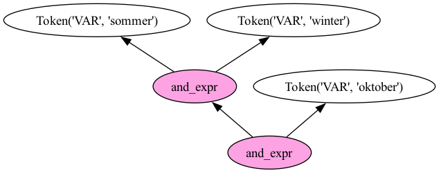

# Praxisteil Nr. 5

## Anfrageverarbeitung auf Postingslisten

interaktive Webanwendung: https://saschaszott.github.io/ir-hdm-2025/2025-04-24/postingslists-processing/

In dieser Anwendung sind die Basisoperationen AND, OR und NOT+AND (bzw. AND+NOT) mittels **JavaScript** umgesetzt.

## Boolesches Retrieval und Parsing von Booleschen Suchanfragen

Die bereits in JavaScript implementierten Algorithmen für die Anfrageverarbeitung auf dem invertierten Index wurden analog mit **Python** umgesetzt. Zudem ist es erforderlich komplexere Suchanfragen zu unterstützen. Dafür wird ein Parser benötigt.

### Ein einfacher selbstgebastelter Parser

Dieser Parser wurde zu Übungszwecken implementiert. In der Praxis sollten Sie eigene Parser **nur in begründeten Ausnahmefällen** selbst implementieren.

Das Programm liest den bereits im Praxistag erzeugten invertierten Index für die 49 Werke von Goethe aus der JSON-Datei `Goethe-inverted-index.json` ein. Die Datei hat folgende Struktur:

```json
{
    ...
    "herbst": [
        "2230",
        "2319",
        "2320",
        "2402",
        "2403",
        "2404",
        "2405",
        "2408",
        "2411",
        "10425",
        "46021",
        "48919"
    ],
    "herbstabend": [
        "2404"
    ],
    "herbstaufenthalte": [
        "2405"
    ],
    ...
}
```

Anschließend fragt das Programm eine boolesche Suchanfrage vom Nutzer ab. Diese wird schließlich vom Programm geparst. Mit dem Ergebnis des Parsings erfolgt schließlich die Anfrageverarbeitung auf dem invertieren Index.

Start des Programms mittels:

```sh
python 01_boolean-retrieval.py
```

Das Programm unterstützt nur sehr einfache Typen von Suchanfragen:

* 1-Term-Suchanfrage
* negierte 1-Term-Suchanfrage
* Suchanfrage mit mehreren Termen, die jeweils mit AND verknüpft sind
* Suchanfrage mit mehreren Termen, die jeweils mit OR verknüpft sind

Die Eingabe anderer Suchanfragen löst einen **Syntaxfehler** aus.

### Parser, die komplexere boolesche Suchanfragen unterstützen

Hier schauen wir uns zwei erweiterte Ansätze für das Parsing von booleschen Suchanfragen an. Für **einfache Grammatiken** kann `pyparsing` verwendet werden. Für **komplexere Grammatiken** bietet sich die Formulierung der Grammatik in der EBNF an. Mit `lark` steht ein mächtiges Python-Paket zur Verarbeitung von Grammatiken (in EBNF) zur Verfügung. `lark` unterstützt LALR-Parsing.

Ziel ist es folgende Typen von Suchanfragen zu unterstützen:

* gemischte Boolesche Operatoren unter Beachtung der Präzedenzregeln
* Klammerung (auch verschachtelt)
* Negation mit NOT an beliebigen Stellen innerhalb der Suchanfrage (vor Termen oder vor Klammerausdrücken)

#### Parsing mit pyparsing

Zuerst müssen wir das Paket mit dem Paketmanager, z.B. `pip`, installieren:

```sh
pip install pyparsing
```

Nun können wir das Programm starten mit:

```sh
python 02_pyparsing.py
```

Das Programm fragt eine Suchanfrage vom Benutzer ab und gibt anschließend das Ergebnis des Parsings – einen **Parsingbaum** – aus.

Der Parsingbaum wird als eine mit Klammern geschachtelte Struktur ausgegeben.

Für die Boolesche Suchanfrage `(NOT sommer OR winter) AND herbst` gibt das Programm folgende Struktur aus:

```
[[[['NOT', sommer], 'OR', winter], 'AND', herbst]]
```

#### Parsing mit lark

Zuerst müssen wir das Paket mit dem Paketmanager, z.B. `pip`, installieren:

```sh
pip install lark
```

Nun können wir das Programm starten mit:

```sh
python 03_lark.py
```

Das Programm fragt eine Suchanfrage vom Benutzer ab und gibt anschließend das Ergebnis des Parsings – einen **AST (abstrakten Syntaxbaum)** – aus.

Für die Boolesche Suchanfrage `(NOT sommer OR winter) AND herbst` gibt das Programm folgenden AST aus:

```
and_expr
  or_expr
    not_expr    sommer
    winter
  herbst
```

#### Grafische Ausgabe des AST

Wir wollen nun eine grafische Darstellung des AST ausgeben.

Zuerst müssen wir das Paket `pydot` mit dem Paketmanager, z.B. `pip`, installieren:

```sh
pip install pydot 
```

Mit dem Programm `04_lark-parsetree.py` kann der AST in Form einer PNG-Grafik (`parsetree.png`) ausgegeben werden, wobei der Baum in der Orientierung `BT` (Bottom to Top) ausgegeben wird, so dass die Blattknoten oben und der Wurzelknoten unten erscheinen.

Wir können das Programm starten mit:

```sh
python 04_lark-parsetree.py
```

Das Programm fragt eine Suchanfrage vom Benutzer ab und erzeugt anschließend eine PNG-Datei mit dem Namen `parsetree.png`.

Für die Boolesche Suchanfrage `(NOT sommer OR winter) AND herbst` ergibt sich folgende Darstellung des AST:


